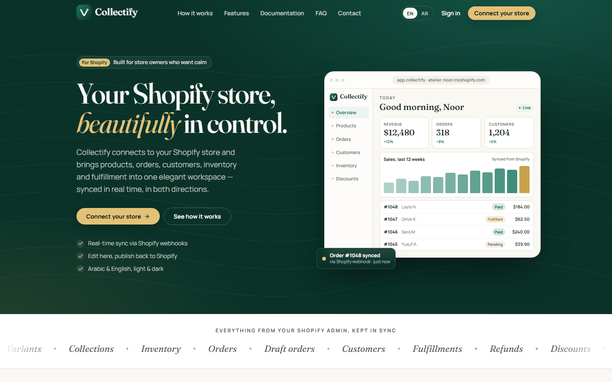
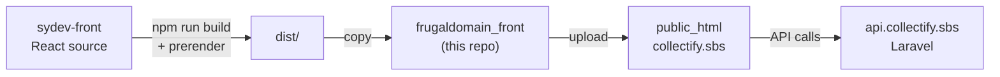
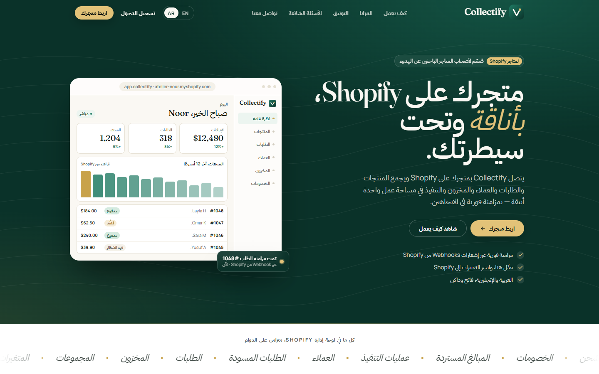

<div align="center">


# Collectify: Production Build

**The deployed, static build of the Collectify frontend, served at [collectify.sbs](https://collectify.sbs).**


[Live site](https://collectify.sbs) · [Frontend source](https://github.com/mhamdNaser/sydev-front) · [Backend API](https://github.com/mhamdNaser/frugaldomain)

</div>



> [!IMPORTANT]
> **Do not edit files in this repository by hand.** Everything except `.htaccess` and this README is generated by `npm run build` in [**sydev-front**](https://github.com/mhamdNaser/sydev-front). Make changes there, rebuild, and copy the output here.

---

## What this repository is

Collectify's frontend is split across two repositories:

| Repository | Contents | Who works in it |
|---|---|---|
| [`sydev-front`](https://github.com/mhamdNaser/sydev-front) | React source code | Developers |
| **`frugaldomain_front`** (this one) | Compiled output of `sydev-front`, ready to upload | Deployment |

Keeping the build in its own repo means production is a plain folder of static files. Any Apache host can serve it with no Node.js on the server, and each deploy is a commit, so rolling back means checking out an earlier commit.



---

## What's inside

```
├── index.html                  # SPA entry + prerendered home page
├── About-Us/index.html         # ┐
│   └── muhammed-nasser-edden/  # │
├── Contact-Us/index.html       # │ prerendered public pages
├── Faq/index.html              # │ (real HTML for search engines
├── Privacy-Policy/index.html   # │  and link previews)
├── Terms-Of-Service/index.html # │
├── documentation/index.html    # ┘
├── assets/                     # fingerprinted JS/CSS bundles (code-split per page)
├── json/                       # sidebar menu, documentation content, currencies, timezones
├── helpJson/                   # in-app Help Center topics (EN/AR)
├── images/                     # logo, default image, profile photo
├── robots.txt                  # blocks /admin, points to the sitemap
├── sitemap.xml                 # 8 public URLs
├── google…html                 # Google Search Console verification
└── .htaccess                   # routing, caching, compression, security headers
```

### How a request is served

| URL | Served file | Why |
|---|---|---|
| `/` | `index.html` | Prerendered home |
| `/Faq` | `Faq/index.html` | Prerendered page, no redirect |
| `/Faq/` | 301 → `/Faq` | One canonical URL per page |
| `/admin/allproducts` | `index.html` | SPA fallback; React Router renders the dashboard |
| `/assets/index-C83g7N3A.js` | the file itself | Real files pass straight through |

Public pages load as full HTML, so they are fast and search engines can index them. React then takes over in the browser. The dashboard (`/admin/*`) is a normal single-page app behind login.

<p align="center">
  
  <br/><sub>The same build serves Arabic (RTL) and English. The language is switched at runtime.</sub>
</p>

---

## `.htaccess` explained

| Section | What it does |
|---|---|
| `DirectorySlash Off` | Stops Apache from redirecting `/Faq` to `/Faq/`, which made search engines treat every page as a redirect |
| Trailing-slash rule | `/Faq/` → **301** → `/Faq` |
| Case fix for `about-us/…` | The build runs on Windows, which is case-insensitive, so the profile page lands under `About-Us/`. Linux is case-sensitive, so the lowercase URL is mapped explicitly. |
| Prerender rule | `/X` → `X/index.html` when that file exists |
| SPA fallback | Every other route → `/index.html` |
| `mod_expires` / `Cache-Control` | Hashed assets are cached for **1 year** (`immutable`). HTML is **never cached**, so visitors always load the latest bundle after a deploy. |
| `mod_deflate` | Gzip for HTML, CSS, JS, JSON, XML and SVG |
| Security headers | `X-Content-Type-Options: nosniff`, `Referrer-Policy: strict-origin-when-cross-origin` |

---

## Deploying a new version

```bash
# 1. Build in the source repo
cd sydev-front
npm run build                      # needs Chrome or Edge installed for prerendering

# 2. Replace the build files here, keeping .htaccess, README.md, .github and .git
cd ../frugaldomain_front
find . -mindepth 1 -maxdepth 1 ! -name '.git' ! -name '.github' ! -name '.htaccess' ! -name 'README.md' -exec rm -rf {} +
cp -r ../sydev-front/dist/. .

# 3. Commit and push
git add -A
git commit -m "Deploy: <short description>"
git push

# 4. Upload the contents to public_html (Hostinger File Manager, FTP or Git deploy)
```

### After deploying, check

- [ ] `https://collectify.sbs/Faq` returns **200**, not 301
- [ ] View-source on a public page shows real content and a `<link rel="canonical">`
- [ ] `/admin/login` loads and signs in against `api.collectify.sbs`
- [ ] Hard-refresh a dashboard route such as `/admin/allproducts`: it should load, not 404
- [ ] `sitemap.xml` and `robots.txt` are reachable

### Rolling back

```bash
git log --oneline                 # find the last good deploy
git checkout <commit> -- .        # restore its files
git commit -m "Rollback to <commit>" && git push
# then upload again
```

---

## Hosting requirements

- Apache with `mod_rewrite` (required), and `mod_headers`, `mod_expires` and `mod_deflate` (recommended)
- `AllowOverride All` so that `.htaccess` is applied
- HTTPS. The auth cookie is set with `secure` and `sameSite=strict`.
- The API at `https://api.collectify.sbs/api` must allow `https://collectify.sbs` in its CORS settings

---

<div align="center">

Part of **Collectify** · built by **Muhammed Nasser Edden**

</div>
